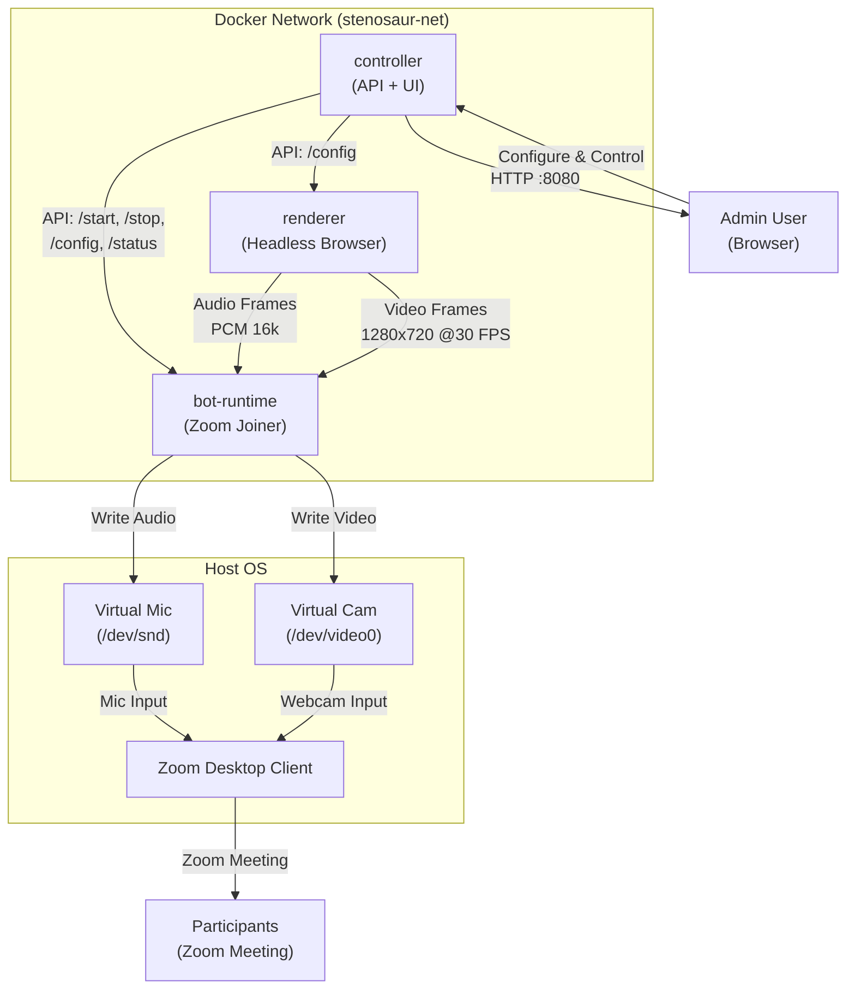
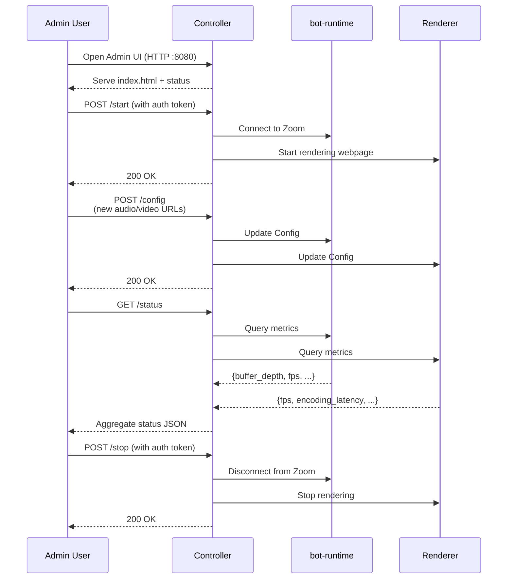

# Stenosaur: Architecture & Design

## Overview

**stenosaur** is a containerized Zoom bot that:
1. Joins a Zoom meeting (unattended).
2. Emulates a microphone and injects audio from a web source.
3. Emulates a webcam and injects video rendered from a webpage.
4. Exposes a web UI + API to configure sources, start/stop, and monitor status.

Three-service architecture running in Docker Compose:
- **bot-runtime**: Joins Zoom, manages virtual mic/cam, publishes media.
- **renderer**: Renders webpages to frames, captures/produces audio.
- **controller**: HTTP API + web admin UI; configures sources and monitors status.

---

## Service Topology



---

## Audio Pipeline

```mermaid
flowchart LR
    WA["Web Audio Source<br/>(URL: MP3, WAV, etc.)"]
    RD["renderer:<br/>Fetch & Decode"]
    AB["Audio Buffer<br/>(PCM 16-bit LE<br/>16 kHz, mono)"]
    BR["bot-runtime:<br/>Consume & Stream"]
    MIC["Virtual Mic Device<br/>(/dev/snd)"]
    ZC["Zoom Client"]
    ZOOM["Zoom Meeting<br/>(Participants)"]
    
    WA -->|HTTP GET| RD
    RD -->|Decode<br/>Normalize| AB
    AB -->|Circular Buffer<br/>Watermark| BR
    BR -->|Write Frames| MIC
    MIC -->|Mic Input| ZC
    ZC -->|Audio| ZOOM
    
    style AB fill:#e1f5fe
    style BR fill:#c8e6c9
    style MIC fill:#fff9c4
```



**Format Specification:**
- **Codec:** PCM (linear)
- **Bit depth:** 16-bit signed little-endian
- **Sample rate:** 16 kHz (Zoom-standard)
- **Channels:** Mono (1)
- **Buffer capacity:** ~2–5 seconds; watermark at 50%; underrun warning at 25%

---

## Video Pipeline

```mermaid
flowchart LR
    WP["Webpage Source<br/>(URL: HTTP/HTTPS)"]
    RD["renderer:<br/>Headless Browser"]
    FC["Frame Capture<br/>(Screenshot)"]
    ENC["Video Encoder<br/>(H.264 or YUV)"]
    VB["Video Buffer<br/>(up to 5 frames)"]
    BR["bot-runtime:<br/>Consume & Stream"]
    CAM["Virtual Cam Device<br/>(/dev/video0)"]
    ZC["Zoom Client"]
    ZOOM["Zoom Meeting<br/>(Participants)"]
    
    WP -->|HTTP GET| RD
    RD -->|Chromium Render| FC
    FC -->|Raw Pixels| ENC
    ENC -->|Encoded Frame| VB
    VB -->|Queue| BR
    BR -->|Write Frame| CAM
    CAM -->|Webcam Input| ZC
    ZC -->|Video| ZOOM
    
    style VB fill:#e1f5fe
    style BR fill:#c8e6c9
    style CAM fill:#fff9c4
```



**Format Specification:**
- **Resolution:** 1280×720 (fixed; configurable per deployment)
- **Frame rate:** 30 FPS (fixed; configurable per deployment)
- **Codec:** H.264 (preferred) or YUV4:2:0 (fallback)
- **Buffer:** Queue up to 5 frames; drop oldest on overrun

---

## Controller API Flow



---

## Component Responsibilities

### bot-runtime
**Role:** Joins a Zoom meeting, manages virtual mic/cam devices, publishes media.

**Key Tasks:**
- Read config (Zoom credentials, meeting URL, device paths, auth token).
- Initialize virtual audio/video device sinks (platform-specific).
- Join Zoom meeting programmatically (method TBD: SDK vs. client automation).
- Consume audio/video frames from shared buffers; inject into virtual devices.
- Health checks: device writable, Zoom connected, buffer depth.
- Graceful shutdown on SIGTERM.

---

### renderer
**Role:** Render webpages and capture audio; produce normalized frames/samples.

**Key Tasks:**
- Read config (webpage URL, audio source URL, viewport, FPS, sample rate).
- Spin up headless browser (Chromium/Playwright/Puppeteer).
- Render configured webpage at fixed viewport (e.g., 1280×720).
- Capture frames at fixed FPS (e.g., 30 FPS).
- Fetch/decode audio from source (WAV, MP3, or synthetic tone).
- Encode video to negotiated format (H.264 or raw YUV).
- Normalize audio to PCM 16-bit LE, target sample rate (16 kHz).
- Buffer frames/samples with timestamps; expose via IPC.
- Metrics: FPS delivered, underruns, encoding latency.

---

### controller
**Role:** HTTP API + web UI for managing bot state and viewing metrics.

**Key Tasks:**
- Expose HTTP API endpoints:
  - `GET /healthz` — basic readiness.
  - `GET /readyz` — full readiness (Zoom connected, devices ready, renderer working).
  - `POST /start` — begin streaming (auth required).
  - `POST /stop` — end streaming (auth required).
  - `GET /status` — current state, FPS, buffer depth, source URLs.
  - `POST /config` — update source URLs, viewport, FPS (requires auth).
- Serve static web UI (HTML + JS) for admin dashboard.
- Validate Bearer token on protected endpoints.
- Health checks: can reach bot-runtime and renderer services.

---

## Configuration & Environment Variables

All config comes from environment variables (set via `.env` or passed to Docker).

**Required (no defaults):**
- `ZOOM_USERNAME` — Zoom username for bot account.
- `ZOOM_PASSWORD` — Zoom password (or auth token; handle securely).
- `MEETING_URL` — Zoom meeting link to join (e.g., `https://zoom.us/j/1234567890`).
- `ADMIN_TOKEN` — Bearer token for protected endpoints (e.g., `secret-key-here`).

**Audio/Rendering:**
- `AUDIO_SOURCE_URL` — URL to fetch audio from (e.g., `https://domain.com/stream.wav`).
- `VIDEO_SOURCE_URL` — Webpage URL to render (e.g., `https://domain.com/dashboard`).
- `AUDIO_SAMPLE_RATE` — Sample rate in Hz (default: 16000).
- `RENDERER_VIEWPORT` — Viewport size, WIDTHxHEIGHT (default: 1280x720).
- `RENDERER_FPS` — Frame rate (default: 30).

**Device Paths (per OS):**
- `MIC_DEVICE_PATH` — Path to virtual mic device (Linux: `/dev/snd/pcmC0D0p`; macOS: CoreAudio loopback; Windows: VB-Audio device name).
- `CAM_DEVICE_PATH` — Path to virtual camera device (Linux: `/dev/video0`; macOS: CoreMediaIO; Windows: DirectShow filter).

**Observability:**
- `LOG_LEVEL` — log severity (debug, info, warn, error; default: info).
- `METRICS_INTERVAL_SECS` — how often to log metrics (default: 10).
- `CONTROLLER_PORT` — HTTP port for controller API (default: 8080).

---

## Prerequisites & OS/Container Setup

### Linux (Recommended for Initial Development)

**Virtual Audio Device:**
```bash
sudo apt-get install pulseaudio pulseaudio-utils
pactl load-module module-loopback
# OR use ALSA loopback:
sudo modprobe snd-aloop
```

**Virtual Webcam:**
```bash
sudo apt-get install v4l2loopback-dkms
sudo modprobe v4l2loopback
ls -la /dev/video0
```

**Docker:**
- Pass `--device /dev/snd:/dev/snd` and `--device /dev/video0:/dev/video0` to docker-compose.
- See `docker-compose.yml` for device mapping.

### macOS

**Virtual Audio Device:**
- Use CoreAudio loopback (native) or BlackHole (third-party).
- Configure in Zoom settings to use loopback as mic input.

**Virtual Webcam:**
- Use CoreMediaIO plugins or OBS virtual camera.
- Complex setup; document in troubleshooting.

### Windows

**Virtual Audio Device:**
- Use VB-Audio Virtual Cable (free or paid).
- Configure in Zoom settings.

**Virtual Webcam:**
- Use VirtualCamera or DirectShow filters.
- Advanced setup; see troubleshooting.

---

## Local Runbook

### Setup (One-Time)

1. **Install Docker Desktop** (or Docker Engine + Docker Compose).
2. **Clone the repo:**
   ```bash
   git clone https://github.com/mkoelle/stenosaur.git
   cd stenosaur
   ```
3. **Prepare virtual devices:**
   - Linux: Follow steps above for PulseAudio loopback + v4l2loopback.
   - macOS/Windows: See TROUBLESHOOTING.md.
4. **Copy `.env.example` to `.env`:**
   ```bash
   cp .env.example .env
   ```
5. **Fill in `.env`:**
   - Set ZOOM_USERNAME, ZOOM_PASSWORD, MEETING_URL.
   - Set AUDIO_SOURCE_URL, VIDEO_SOURCE_URL (or use test mode).
   - Set ADMIN_TOKEN (choose a secret value).

### Run Locally

```bash
# Build all services
docker-compose build

# Start all services
docker-compose up

# In another terminal, check health
curl http://localhost:8080/healthz

# Get status
curl -H "Authorization: Bearer <ADMIN_TOKEN>" http://localhost:8080/status

# Start streaming
curl -X POST -H "Authorization: Bearer <ADMIN_TOKEN>" http://localhost:8080/start

# Stop streaming
curl -X POST -H "Authorization: Bearer <ADMIN_TOKEN>" http://localhost:8080/stop
```

### Monitoring

```bash
# Follow logs
docker-compose logs -f

# Check specific service
docker-compose logs -f bot-runtime
```

---

## Observability & Logging

### Log Format
All logs use structured JSON with a `component` field:
```json
{
  "timestamp": "2026-03-11T10:00:00Z",
  "component": "bot-runtime",
  "level": "info",
  "message": "Joined Zoom meeting",
  "context": { "meeting_id": "123456789" }
}
```

### Metrics
Exposed via `/status` endpoint:
- Audio buffer depth (samples), underruns, overruns.
- Video FPS delivered, frame drops, encoding latency.
- Zoom connection state (connected, disconnected, reconnecting).
- Service health (all components reachable).

### Health Checks
- `/healthz` — is the service running? (200 OK = yes).
- `/readyz` — are all subsystems ready? (200 OK = Zoom connected, devices writable, renderer producing).

---

## Open Design Decisions

### 1. Zoom Integration Approach
**Options:**
- **SDK:** Use Zoom SDK (requires license/registration); more direct, cleaner.
- **Client Automation:** Automate Zoom desktop client (e.g., Selenium); fragile, but no SDK registration.

**Decision Required:** Confirm with team before Phase 2.

### 2. Web Audio Source Mechanism
**Options:**
- **HTTP Stream:** Fetch WAV/MP3 from URL; decode locally.
- **WebRTC:** Receive audio stream from browser peer.
- **Synthetic Tone:** Generate test audio (440 Hz sine wave); for testing only.

**Decision Required:** Depends on final use case.

### 3. Video Frame Format
**Options:**
- **H.264:** Compressed; more efficient; encoding latency ~50ms.
- **YUV4:2:0:** Raw; simpler; larger frames; ~10ms latency.

**Decision Required:** Based on Zoom SDK capabilities.

---

## Testing Strategy

### Unit Tests
- Buffer operations (enqueue, dequeue, watermark checks).
- Audio resampling/drift correction.
- Config validation and env var parsing.

### Integration Tests
- Docker Compose up: all services start, healthz passes.
- Renderer produces frames at target FPS.
- Audio buffer stays within bounds (no underruns under normal load).
- API endpoints respond correctly (auth validated).

### Smoke Tests
- Manual: Bot joins Zoom meeting, audio/video visible to other participants.
- Duration: 5–10 minutes; verify no memory leaks.

---

## Security Considerations

- **Secrets:** Store ZOOM_PASSWORD and ADMIN_TOKEN securely (env vars, secrets manager); never log them.
- **Auth:** All mutating endpoints (POST /start, /stop, /config) require Bearer token.
- **CORS:** If UI served from different origin, configure CORS headers carefully.
- **Docker:** Do not run with `--privileged` unless necessary; grant only required capabilities.

---

## Troubleshooting

### Common Issues

**Virtual Audio/Video Devices Not Found**
- Linux: Ensure PulseAudio loopback and v4l2loopback are installed and loaded.
- macOS: Install CoreAudio loopback or BlackHole; configure in Zoom settings.
- Windows: Install VB-Audio Virtual Cable; check device manager.
- Docker: Pass `--device` flags in docker-compose.yml; verify host paths match.

**Buffer Underruns/Overruns**
- Check `/status` endpoint for buffer metrics.
- Tune watermark threshold in env vars.
- Check logs for encoding/rendering delays.

**Zoom Client Not Connecting**
- Verify Zoom credentials in `.env` are correct.
- Check if SDK or client automation is properly configured (see open decisions).
- Ensure virtual devices are writable and Zoom is configured to use them.

**High Encoding Latency**
- If using H.264, consider YUV4:2:0 (faster but larger frames).
- Check renderer logs for frame capture delays.
- Reduce RENDERER_FPS if needed.

---

## Reference

- **Zoom API Docs:** [https://developers.zoom.com](https://developers.zoom.com)
- **Docker Compose:** [https://docs.docker.com/compose](https://docs.docker.com/compose)
- **PulseAudio Loopback:** [https://wiki.archlinux.org/title/PulseAudio#Loopback_interface](https://wiki.archlinux.org/title/PulseAudio#Loopback_interface)
- **v4l2loopback:** [https://github.com/umlaeute/v4l2loopback](https://github.com/umlaeute/v4l2loopback)
- **Playwright (Browser Rendering):** [https://playwright.dev](https://playwright.dev)
- **Puppeteer (Browser Rendering):** [https://pptr.dev](https://pptr.dev)

---

## Appendix: Future Extensions

- **Playlist management** — Queue multiple audio files; cycle webpages.
- **Transcription** — Capture meeting audio; apply speech-to-text.
- **Audio ducking** — Detect speaker; lower playback volume during speech.
- **Adapter pattern** — Support Discord, custom sinks (file, WebRTC).
- **Hot-reload** — Update source URLs without restarting services.
- **Prometheus metrics** — Export `/metrics` endpoint for monitoring.